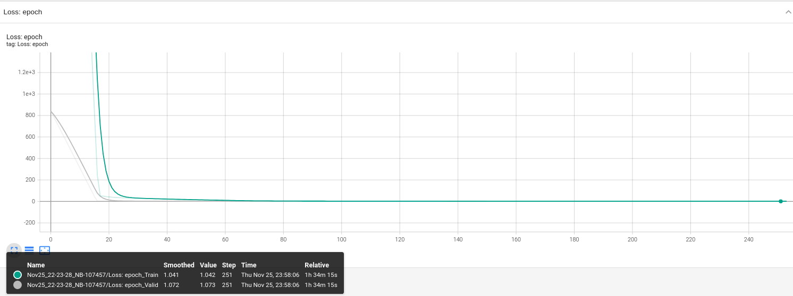
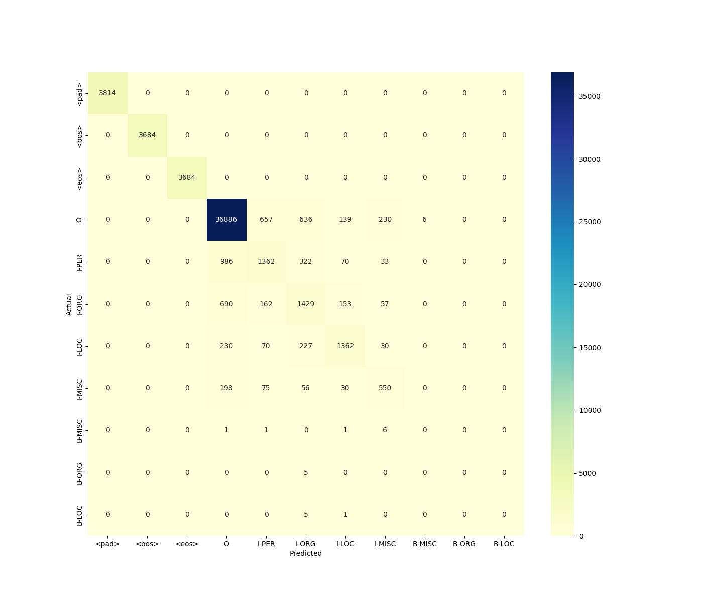
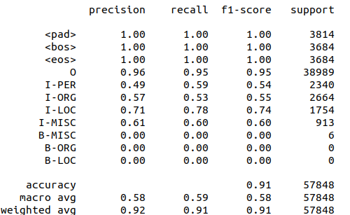

# Named Entity Recognition
Named Entity Recognition task was implemented with using Bi-LSTM with CRF layer.
In order to train the neural network the Conll2013 dataset was used. 

### Training process
Model was training more than 250 epochs. 
**After the 250 epoch overfitting was appeared.** 

### Received results

Trained model was tested on validation dataset. 
In order to better understand the weaknesses of the model the confusion matrix was built. 

On top of that, the classification report was printed.

